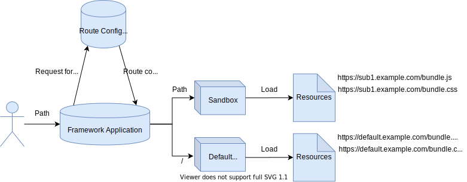

# Guide

## Introduction

Polyatomic is an implementation of concepts from [Micro Frontends](https://micro-frontends.org/). It was designed to make it easier to build new micro-frontend applications and at the same time be less intrusive migrating existed project to micro-frontend.

### Concepts and Technical Terms

- Micro Frontend: technology, implemented methods or methodology to build micro-frontend apps
- Micro Frontend Apps: the projects or applications build with micro-frontend technology
- Framework: or *framework-application(s)* or *master-application(s)*, the dock to load sub-applications. It also solves the global events and stores global states.
- Sub-application(s): could be loaded by framework-application, and also be able to work independently as an independent application under certain circumstances (Which is called *Atomicity*).

### What is Micro-Frontend

> Please check the [Micro Frontends](https://micro-frontends.org/) and [Patterns for Micro Frontends - ThoughtWorks Talks Tech
](https://www.youtube.com/watch?v=tcQ1nWdb7iw&t=269s) first!

As [Michael Geers](http://geers.tv/) said in [Micro Frontends](https://micro-frontends.org/):

> The idea behind Micro Frontends is to think about a website or web app as a composition of features which are owned by independent teams. Each team has a distinct area of business or mission it cares about and specialises in. A team is cross functional and develops its features end-to-end, from database to user interface.

Opposite from [Frontend Monolith](https://www.youtube.com/watch?v=pU1gXA0rfwc), Micro-frontend apps are composition of many independent sub-applications, and the core ideas of micro-frontend are shown as below:

- **Be Technology Agnostic**

Each team should be able to choose and upgrade their stack without having to coordinate with other teams. Custom Elements are a great way to hide implementation details while providing a neutral interface to others.

- **Isolate Team Code**

Don’t share a runtime, even if all teams use the same framework. Build independent apps that are self contained. Don’t rely on shared state or global variables.

- **Establish Team Prefixes**

Agree on naming conventions where isolation is not possible yet. Namespace CSS, Events, Local Storage and Cookies to avoid collisions and clarify ownership.
Favor Native Browser Features over Custom APIs
Use Browser Events for communication instead of building a global PubSub system. If you really have to build a cross team API, try keeping it as simple as possible.

- **Build a Resilient Site**

Your feature should be useful, even if JavaScript failed or hasn’t executed yet. Use Universal Rendering and Progressive Enhancement to improve perceived performance.

### What's Different in Polyatomic

The only difference between Polyatomic and principles in [Micro Frontends](https://micro-frontends.org/) is, as it will probably always be, Polyatomic uses global states, methods, dependencies, event buses to make it easier for communication between framework and sub-applications, or between sub-applications.

### Why it's Called "Polyatomic"

As we all know, in the chemical world, the smallest divisible unit of matter is an atom, such as a hydrogen atom, an oxygen atom, and so on. Atoms can be formed into molecules, for example, two hydrogen atoms and one oxygen atom could be constituted into a water molecule. On the other hand, atoms can exist independently and constitute certain substances. At this time, we call them *monoatomic molecules*, for example, helium (gas) is a gaseous single substance composed of helium atoms.

A project with micro-frontend technology could be considered as a *molecule* application, and the sub-applications that constitute with framework to form the whole project, could be considered as *atom* applications. That is, the whole project is a molecule consisted with poly atoms, that is why we named our micro-frontend technology as *Polyatomic*

### How Does Polyatomic Works

To get understand of how it works, here we put an image to show the main processes of what will Polyatomic do when starting a micro-frontend-powered application:



Sandbox is the core of Polyatomic, which provides a pure environment for each sub-application. When the user request a path of the application, the framework would make a request to a server to obtain the route configuration for this application. Then it would load sandbox with the top-level route path. For example, if a user request a route like `https://foo.com/bar/baz` while base path was set as `http://foo.com/`, if `/bar` hits the route config and there is no sandbox with the same path exist in sandboxes map, Polyatomic will create a new sandbox to load resources, and take snapshots from `window` and `document.head`. If `/bar` matches one of the sandbox in sandboxes map, Polyatomic will use that sandbox and restore the snapshots to `window` and `document.head`.

It is worth paying attention that Polyatomic will only match the first level of the route: if get a path like `/bar/baz`, it will only take `/bar` to find a matching route config. Downward routes, like `/baz`, would be taken over by sub-applications.

After finishing loading resources, sandbox will execute the bundle by `new Function()`, and the other resources by appending child nodes into targeted parent nodes.

Polyatomic uses `history` to manage the top level routes, especially listen route changes. All the route and sandbox changes would be managed by `history` listener.

When the top level route changing, the former sandbox will unmount, then mount next sandbox with the new path. The `loading`, `loaded`, `mounted`, `beforeUnmount` and `umounted` lifecycle hooks will be triggered when changing route.

Polyatomic overwrites `Element.prototype.appendChild` to prevent appending duplicated element to document, and overwrites `Window.prototype.addEventListener` to record the listeners that are created by sandboxes, for cleaning the listeners when umounting current sandbox.

### Features

All the features are updated in [here](https://github.com/lenconda/polyatomic/tree/docs#features)

## Quick Start

> The project is still under development, it is unrealistic to install it from npm, but you can clone this project from GitHub and bundle it into your project.

### Framework

The simplest HTML structure Polyatomic required is:

```html
<!DOCTYPE html>
<html>
  <head>
    <meta charset="UTF-8">
    <title></title>
    <meta http-equiv="X-UA-Compatible" content="IE=edge,chrome=1" />
    <meta name="viewport" content="width=device-width, user-scalable=no, initial-scale=1.0, maximum-scale=1.0, minimum-scale=1.0" />
  </head>
  <body></body>
</html>
```

Route links that could be intercepted by Polyatomic should be added a `data-polyatomic` attribute:

In HTML/Vue template/JSX:

```html
<!-- It will be intercepted by Polyatomic -->
<a href="/foo" data-polyatomic>Foo</a>

<!-- It will not be intercepted by Polyatomic, just jump to /foo/index.html -->
<a href="/foo"></a>
```

Import Polyatomic in your framework:

```javascript
import Polyatomic from '/path/to/polyatomic';
// or by UMD
<script src="/path/to/polyatomic.min.js"></script>
```

Initialize the framework application with:

```javascript
const app = new Polyatomic('root');
```

`root` is the mount point ID which sub-applications will mount onto.

Register modules (sub-applications route configuration), for example:

```javascript
app.registerModules({
  '/vue': {
    scripts: [
      '//localhost:8181/app.js',
    ],
    styles: [],
  },
  '/react': {
    scripts: [
      '//localhost:8182/static/js/main.bundle.js',
      '//localhost:8182/static/js/vendors.chunk.js',
    ],
    styles: [
      '//localhost:8182/static/css/main.css',
    ],
  },
});
```

it is also easy to load route configuration from a remote server:

```javascript
fetch('https://foo.com/api/routes').then(routes => app.registerModules(routes.json()));
```

Create a listener for hooks:

```javascript
app.hook.unmounted = function(prev, next, sandbox) {
  console.log('unmounted', this);
  console.log('prev: ', prev);
  console.log('next: ', next);
  console.log('sandbox: ', sandbox);
};
```

Finally, run the framework:

```javascript
app.run();
```


### Sub Application

Since Polyatomic is low invasive, we can just make a few modifications on sub-applications. The simplest change to make sub-applications work is changing bundle prefix. For example, if using Webpack as bundler, just:

```javascript
module.exports = {
  // ...
  output: {
    // ...
    // When in production mode, use an absolute prefix
    publicPath: process.NODE_ENV === 'production' ? '//example.com' : '/',
  },
}
```
