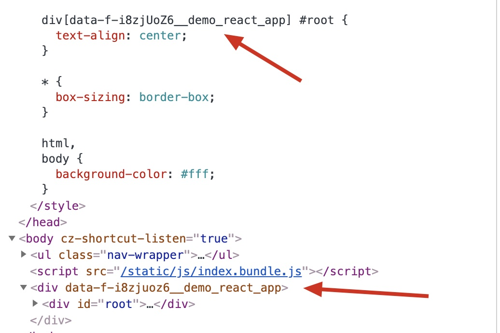

# 开发指南

## 介绍

Faun (国际标准音标：/ˈfɔːn/) 是一个对 [micro-frontends.org](https://micro-frontends.org/) 规范的实现。它旨在提供更简单的构建微前端架构应用的方式，与此同时以最小侵入性将既有应用接入到微前端架构。

### 概念与技术术语

- 微前端：一种用于构建前端微服务化架构应用的技术、实现手段或方法论
- 微前端应用：使用微前端技术构建的项目或应用
- 框架（或 *框架应用、 主应用*)：加载子应用的容器。并且可以处理全局事件以及存储全局状态
- 子应用：可以被框架应用加载，并且也可以作为一个独立应用单独在特定条件下被部署运行

### 什么是微前端

> 请先阅读[微前端](https://micro-frontends.org/)以及[微前端模式 - ThoughtWorks 技术讨论会](https://www.youtube.com/watch?v=tcQ1nWdb7iw&t=269s)！

正如 [Michael Geers](http://geers.tv/) 在 [Micro Frontends](https://micro-frontends.org/)中所说：

> 微前端背后的思想就是将一个网站或 Web 应用当作多个独立团队所提供的（用于构成这个网站或 Web 应用的）特性的聚合物。每个团队有他们自己关心和专长的独特的业务领域或任务。一个团队是一个全栈的，并且可以从数据库到用户界面提供全方位开发支持。

与[前端巨石应用](https://www.youtube.com/watch?v=pU1gXA0rfwc)相反，微前端应用聚合了很多独立的子应用，其核心思想如下：

- **技术栈黑盒化**

每个团队都可以不受其他团队约束地选择和升级他们的技术栈。自定义元素是一个面向其他团队提供完整接口时隐藏实现细节的非常棒的方式。

- **代码隔离**

即使所有的团队都使用同一个框架，也不要共享同一个运行时。构建可以自托管的独立应用，并且不要依赖共享的状态或全局变量。

- **建立团队前缀规则**

在代码隔离尚无法做到的地方就命名约定达成一致：在 CSS 命名空间、事件、LocalStorage 以及 Cookie 上避免冲突以及分清所有权。浏览器原生特性优先，而不是自定义 API 优先。使用浏览器事件进行通信，而不是创建全局的发布订阅系统。如果确实必须提供跨团队 API，尝试使它尽可能地简单。

- **构建健壮性足够的应用**

即使 JavaScript 出错或一直没有被执行，你提供的功能也应该是有效的。使用单一通用的渲染方式以及渐进增强方案来提高可以预见的性能。

### Faun 是如何运行的

为了理解 Faun 是如何运行的，我们在下文中展示了一张图片，用于阐述在启动一个微前端应用时 Faun 会做些什么：


首先，Faun 通过 `history` 管理顶级路由，并监听路由的变化。所有的路由和沙箱的变化都会被 `history` 监听器所管理。

一旦 `history.push` 被触发，Faun 将会调用加载器去加载资源，并最终将这些资源挂载在框架应用上。Faun 将这个过程抽象成独立的模块，命名为*沙箱（Sandbox）*。在 Faun 中，沙箱承担了承载子应用的任务，并且为每个子应用提供了一个纯净的环境。当用户请求了应用的某个路径，框架应用将会向服务器发起请求以获得该应用中所有子应用的映射。

Faun 通过顶级路由的变化加载沙箱。例如，如果一个用户请求了一个类似于 `https://foo.com/bar/baz` 并且应用基准路径为 `https://foo.com/` 的路由，如果 `/bar` 命中了子应用路由配置，Faun 将会创建一个新的沙箱以加载资源，并且为 `window` 拍摄快照。

与此同时，沙箱将会在 `Element.prototype` 层面重写 DOM 操作（例如 `appendChild`、`insertBefore`） 以及 `window.addEventListener` 以捕获快照以及做一些拦截更改。

一个被兼容的 `MutationObserver` 将会被开启以捕获 DOM 的变化并将其加入到一个数组中。当沙箱被卸载时，在这个数组中的所有元素将会被移除。

> 值得注意的是，Faun 只会匹配顶级路由：如果有一个路径类似于 `/bar/baz`，它将只会使用 `/bar` 去寻找一个相匹配的路由配置。下级路由，例如 `/baz`，则会被当前子应用接管。

当资源加载完成后，沙箱将通过 `new Function()` 执行这些资源，并且将其他资源附加到目标节点后。

当顶级路由发生变化时，之前当沙箱将会被卸载，再根据新的路径加载下一个沙箱。生命周期钩子 `loading`、`loaded`、`mounted`、`beforeUnmount` 以及 `unmounted` 将会在路由变化时被触发。

### 特性

所有的特性都会更新在[这里](https://github.com/lenconda/faun/tree/docs#features)

## 迁移或创建新的 Faun 应用

### 提供一个框架应用

Faun 所需要的最简单的 HTML 结构如下：

```html
<!DOCTYPE html>
<html>
  <head>
    <meta charset="UTF-8">
    <title></title>
    <meta http-equiv="X-UA-Compatible" content="IE=edge,chrome=1" />
    <meta name="viewport" content="width=device-width, user-scalable=no, initial-scale=1.0, maximum-scale=1.0, minimum-scale=1.0" />
  </head>
  <body></body>
</html>
```

Faun 可以拦截的路由链接需要添加 `data-faun-link` 属性：

在 HTML、Vue 模板或 JSX 中：

```html
<!-- 它将会被 Faun 的 history 监听器捕获 -->
<a href="/foo" data-faun-link>Foo</a>

<!-- 它不会被 Faun 捕获，仅仅只是跳转到 /foo/index.html -->
<a href="/foo"></a>
```

安装 Faun:

```bash
$ npm i faun -S
# 或者
$ yarn add faun
```

在你的框架应用中引入 Faun：

**通过 CommonJS 方式：**

```javascript
const Faun = require('faun').default;
```

**通过 ES Module 方式：**

```javascript
import Faun from 'faun';
```

**通过 UMD 方式：**

```html
<script src="https://unpkg.com/faun@latest/dist/umd/faun.min.js"></script>
```

**通过 AMD 方式：**

```html
<script src="https://cdnjs.cloudflare.com/ajax/libs/require.js/2.3.6/require.min.js"></script>
<script src="https://unpkg.com/faun@latest/dist/amd/faun.min.js"></script>
<script type="text/javascript">
  require(['faun@$VERSION'], function(Faun) {
    // 通过 Faun 在这里做一些事情
  });
</script>
```

初始化框架应用：

```javascript
const app = new Faun();
```

注册子应用映射，例如：

```javascript
app.registerSubApplications(
  [
    {
      name: 'app1',
      activeWhen: '/app1',
      entry: {
        scripts: [
          '//localhost:8181/app.js',
        ],
      },
      container: 'app',
      assetPublicPath: '//localhost:8181',
    },
    {
      name: 'app2',
      activeWhen: '/app2',
      entry: {
        scripts: [
          '//localhost:8182/static/js/main.bundle.js',
        ],
        styles: [
          '//localhost:8182/static/css/main.css',
        ],
      },
      container: document.querySelector('#root'),
      assetPublicPath: '//localhost:8182',
    },
  ],
);
```

从服务器上加载路由配置也非常简单：

```javascript
fetch('https://foo.com/api/routes')
  .then(routes =>
    app.registerModules(routes.json())
  );
```

设置监听器或钩子：

```javascript
app.registerSubApplications(
  [
    // ...
  ],
  {
    loading: pathname => {
      console.log('loading', this);
      console.log('pathname: ', pathname);
    },
    // ...
  },
);
```

最后，将框架应用跑起来：

```javascript
app.run();
```

### 迁移子应用

由于 Faun 是低侵入性的，我们仅需在子应用上做一些非常少的改动。唯一要做的事就是你可能要在 CSS 和 JavaScript 资源的 URL 能否正确地在框架应用中而花些功夫。

使用 Webpack 打包的应用通常都会将静态资源的 `output.publicPath` 设置为类似于 `/` 的值。由于子应用的 URL 和框架应用的不一样，所以它有可能在加载 Chunked 资源时造成 `404` 错误。

为了避免这一现象，我们推荐修改 `output.publicPath` 成绝对路径。例如，一个应用被部署在 `example.com`，那么它的 `output.publicPath` 就会是 `//example.com`。

Faun 的沙箱也提供了更优的方法 —— `assetURLMapper`，用于修改（Chunked 资源的） URL，仅需在你的子应用配置中将它加入：

```javascript
app.registerSubApplications({
  // ...
  '/app': {
    entry: {
      scripts: [
        // ...
      ],
      styles: [
        // ...
      ],
      // ...
    },
    assetURLMapper: url => `//example.com/${url}`,
  },
});
```

`assetURLMapper` 方法应该返回一个可以正确加载资源的新的 URL。

### 配置服务

由于 Faun 通过 [Ajax](https://developer.mozilla.org/en-US/docs/Web/Guide/AJAX) 加载与获取资源，当浏览器的源（Origin）与框架应用不同时，这种行为可能会被浏览器的[同源策略](https://developer.mozilla.org/en-US/docs/Web/Security/Same-origin_policy)所禁止。在这种情况下，你应该设置 [HTTP CORS](https://developer.mozilla.org/en-US/docs/Web/HTTP/CORS) 头：`Access-Control-Allow-Origin` 并且设置它为框架应用的源或 `*`。

如果子应用部署在 Nginx 上，你只需要向配置文件中加上这个参数：

```nginx
server {
  listen 80;
  server_name app1.example.com;
  # ...
  location / {
    add_header Access-Control-Allow-Origin framework.example.com;
    # ...
  }
}
```

或者部署在 Apache 上：

```apache
Header set Access-Control-Allow-Origin framework.example.com
```

## 进阶指南

### 声明一个容器元素

在被挂载时，每一个子应用都需要选择一个被称为*容器*的 DOM 节点。当在配置子应用时，`container` 字段应该被定义，并且传入 `HTMLElement`、返回 `HTMLElement` 值或一个指示 DOM 节点 ID 的 `string` 类型的值。

示例：

```javascript
app.registerSubApplications([
  {
    name: 'app1',
    // ...
    container: 'app',
  },
  {
    name: 'app2',
    // ...
    container: document.querySelector('#app'),
  },
  {
    name: 'app3',
    // ...
    container: (() => {
      const el = document.createElement('div');
      el.setAttribute('id', 'app');
      return el;
    })(),
  },
]);
```

如果指定了容器元素，Faun 将会使它们在被重复挂载时可以被重复使用。

### 在卸载时清除 DOM 元素

在默认情况下，Faun 在子应用被卸载时会直接移除整个容器元素，与此同时记录下在容器中的节点，并作为可以在子应用的下一次生命周期开始时使用的快照。然而，当你的子应用在被挂载时不会比较 DOM 树或者没有使用 Virtual DOM 时，事情将会变得有些奇怪，因为即使有一个已经存在的 DOM 树（被沙箱通过快照恢复的），它可能也还会渲染 DOM 树。例如，Svelte。

为了考虑上述提及的可能发生的情况，Faun 在子应用配置中提供了一个可选参数，名为 `cleanDOMWhenUnmounting`，默认值为 `false`。如果传入 `true`，沙箱将会通过设置容器元素的 `innerHTML` 为空的方式清除容器元素中所有的节点。

> [注意] 不要在你的 React 子应用中使用这个选项，否则会带来其他的问题。

### CSS 前缀

为 CSS 选择器添加前缀是避免全局样式污染的非常强大的方法。Faun 提供了 `useCSSPrefix` 来为子应用的样式添加前缀。但是它的默认值为 `false`，因为它可能会话费大量的时间递归地为所有的选择器添加前缀，尤其是在选择器数量庞大时。如果将它设置为 `true`，沙箱将会使用当前沙箱的名称作为前缀。

这是将它设置为 `true` 时的效果：

```javascript
app.registerSubApplications([
  // ...
  {
    name: 'demo_react_app',
    // ...
    useCSSPrefix: true,
  },
]);
```



### 静态路由前缀

有些应用有可能有一些用于懒加载的 Chunked 资源，尤其是通过 Webpack 构建的。在大多数情况下，它们被主要的 Bundle 管理，通常不具有 URL 前缀，就像 `/static/js/0.chunk.js`，当它要被加载时，它的 URL 则会跟随当前的 URL，例如 `//app1.example.com/static/js/0.chunk.js`。这可能会导致当子应用的源和框架应用不一样时，子应用的资源会拥有框架应用的 URL 前缀，因此产生 404 错误。

现在有两种方案，最普遍的是给 Chunked 资源加上绝对路径 URL 前缀，在 Webpack 中，它可能是这样的：

```javascript
module.exports = {
  // ...
  output: {
    // ...
    filename: '[name].chunk.js',
    publicPath: '//app1.example.com/static/js',
  },
};
```

另一种更简单，使用 Faun 的 `assetPublicPath` 和 `assetMatchers`。在每一个子应用的配置中，向 `assetPublicPath` 传入一个 `string` 类型的值，这些 Chunked 资源将会被加上这个字符串作为请求资源的 URL，例如，`assetPublicPath` 为 `//app1.example.com/static/js`，Chunked 资源的 URL 是 `0.chunk.js`，所以请求的 URL 就是 `//app1.example.com/static/js`。`assetPublicPath` 也接受 `Function` 类型的值，这个函数将会接受当前的 URL 作为回调参数，你需要返回一个 `string` 类型的最终 URL 用于 Faun 发送请求：

```javascript
app.registerSubApplications([
  {
    // ...
    assetPublicPath: url => `//app1.example.com/static/js/${url}`,
  },
]);
```

不幸的是，Faun 只能识别匹配 `assetPublicPath` 规则的 `<script>` 和 `<link>` 标签，但还有其他资源比如图片和 Favicon 也需要这个功能。Faun 提供了 `assetMatchers` 添加这些标签用于捕获：

```javascript
app.registerSubApplications([
  {
    // ...
    assetPublicPath: url => `//app1.example.com/static/js/${url}`,
    assetMatchers: [
      {
        nodeNames: 'img',
        attributes: ['src'],
      },
    ],
  },
]);
```
